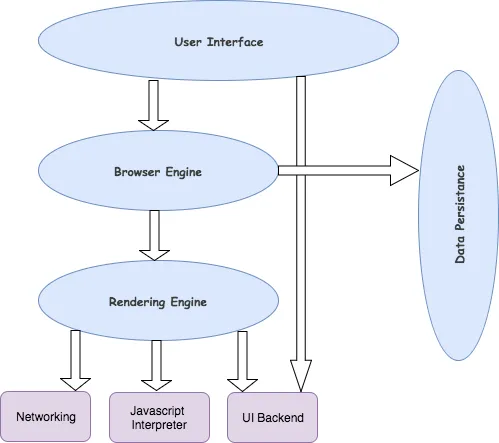

Exercise1.1:1.When a user enters an URL in the browser, how does the browser fetch the desiredresult ? Explain this with the below in mind and Demonstrate this by drawing a diagramfor the same.(2-3hours)
a.What is the main functionality of the browser?

Ans: A web browser takes you anywhere on the internet. It retrieves information from other parts of the web and displays it on your desktop or mobile device. The information is transferred using the Hypertext Transfer Protocol, which defines how text, images and video are transmitted on the web. This information needs to be shared and displayed in a consistent format so that people using any browser, anywhere in the world can see the information.

Sadly, not all browser makers choose to interpret the format in the same way. For users, this means that a website can look and function differently. Creating consistency between browsers, so that any user can enjoy the internet, regardless of the browser they choose, is called web standards.

When the web browser fetches data from an internet connected server, it uses a piece of software called a rendering engine to translate that data into text and images. This data is written in Hypertext Markup Language (HTML) and web browsers read this code to create what we see, hear and experience on the internet.

Hyperlinks allow users to follow a path to other pages or sites on the web. Every webpage, image and video has its own unique Uniform Resource Locator (URL), which is also known as a web address. When a browser visits a server for data, the web address tells the browser where to look for each item that is described in the html, which then tells the browser where it goes on the web page.

b.High Level Components of a browser.
Ans: 
The User Interface: The user interface is the space where User interacts with the browser. It includes the address bar, back and next buttons, home button, refresh and stop, bookmark option, etc. Every other part, except the window where requested web page is displayed, comes under it.
The Browser Engine: The browser engine works as a bridge between the User interface and the rendering engine. According to the inputs from various user interfaces, it queries and manipulates the rendering engine.
The Rendering Engine: The rendering engine, as the name suggests is responsible for rendering the requested web page on the browser screen. The rendering engine interprets the HTML, XML documents and images that are formatted using CSS and generates the layout that is displayed in the User Interface. However, using plugins or extensions, it can display other types data also. Different browsers user different rendering engines:
* Internet Explorer: Trident
* Firefox & other Mozilla browsers: Gecko
* Chrome & Opera 15+: Blink
* Chrome (iPhone) & Safari: Webkit
Networking: Component of the browser which retrieves the URLs using the common internet protocols of HTTP or FTP. The networking component handles all aspects of Internet communication and security. The network component may implement a cache of retrieved documents in order to reduce network traffic.
JavaScript Interpreter: It is the component of the browser which interprets and executes the javascript code embedded in a website. The interpreted results are sent to the rendering engine for display. If the script is external then first the resource is fetched from the network. Parser keeps on hold until the script is executed.
UI Backend: UI backend is used for drawing basic widgets like combo boxes and windows. This backend exposes a generic interface that is not platform specific. It underneath uses operating system user interface methods.
Data Persistence/Storage: This is a persistence layer. Browsers support storage mechanisms such as localStorage, IndexedDB, WebSQL and FileSystem. It is a small database created on the local drive of the computer where the browser is installed. It manages user data such as cache, cookies, bookmarks and preferences.

c.Rendering engine and its use.
d.Parsers (HTML, CSS, etc)
e.Script Processors
f.Tree construction
g.Order of script processing
h.Layout and Painting
